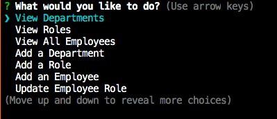
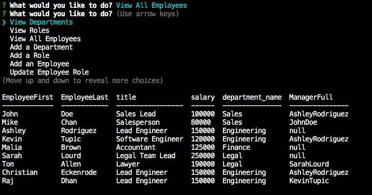

# **Employee Tracker**

## Table of Contents

1. [Description](#description)
2. [License](#license)
3. [Screenshots](#screenshots)
4. [Demonstration](#demonstration)
5. [Questions](#questions)

### Description

AS A business owner
I WANT to be able to view and manage the departments, roles, and employees in my company
SO THAT I can organize and plan my business

### License

This application is covered under the [MIT](https://opensource.org/licenses/MIT) license.

### Screenshots

Visual of the command line inputs:

Employee Table:

### Demonstration

[Click to view a video walkthrough of the application](https://drive.google.com/file/d/1kAIQ9gC0rnDbjL9Veo-sbVRhPa-9FeTu/view)

### Questions

Github Username: **Rajendra-Dhanraj**

[Click to follow and view my Github profile!](https://github.com/Rajendra-Dhanraj)

Alternatively, I can be contacted via email: **Rajendra.Dhanraj@gmail.com**
